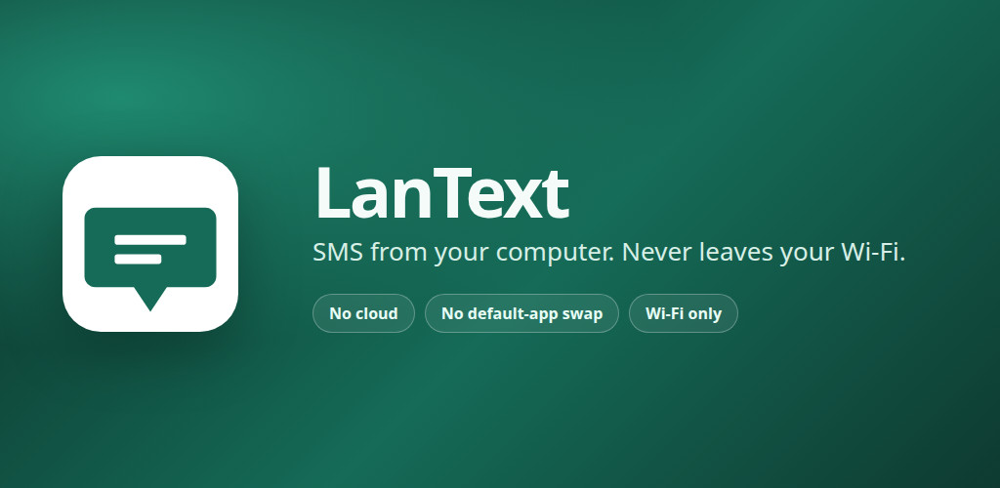
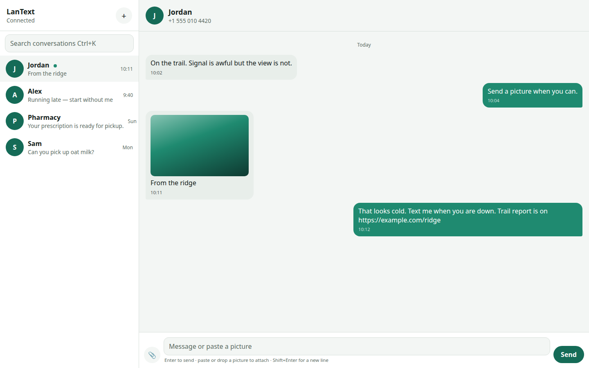
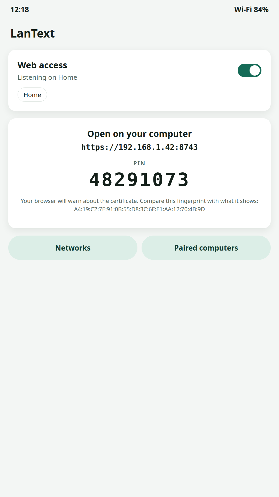
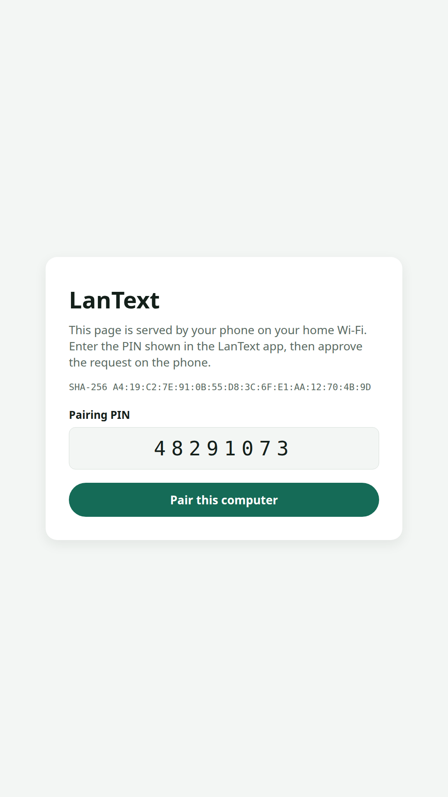
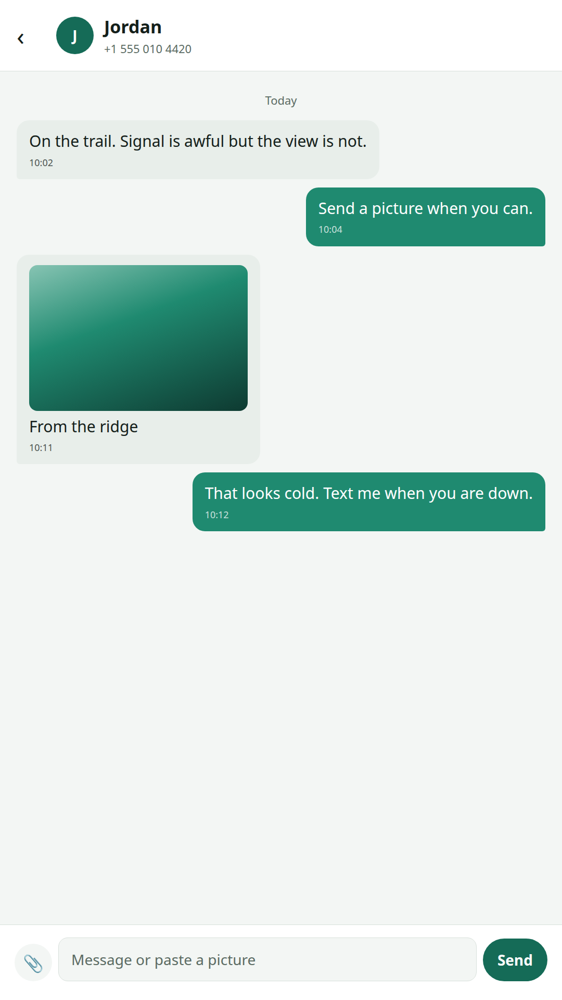

# LanText

**Type SMS on a real keyboard. Paste a picture. Nothing leaves your Wi-Fi.**

[](LICENSE)
[](#build)
[](F-DROID.md)
[](CHANGELOG.md)



LanText is a **companion** for the SMS app you already trust — Fossify Messages,
Google Messages, Samsung Messages, or anything else that uses the system SMS
store. It does **not** become the default messenger.

Install it on the phone, allow your home Wi-Fi, open the HTTPS address in any
browser. You get a two-pane inbox: conversations on the left, the thread on the
right. Texts go out through your carrier. Pictures go out as MMS. The default
app on the phone stays in sync.

There is no account. There is no cloud. Walk off the allowed network and the
server stops.

<p align="center">
  
</p>

## Why this exists

Phones are a miserable place to type. The usual “fixes” are worse:

| | Cloud bridges | Replace the default SMS app | **LanText** |
|---|---|---|---|
| Your texts leave the house | Yes | No | **No** |
| Keep Fossify / Google / Samsung as default | Sometimes | **No** | **Yes** |
| Real keyboard, any OS, any browser | Yes | No | **Yes** |
| Paste a picture, it actually sends | If you pay them | Yes | **Yes** |
| Account / vendor lock-in | Yes | New app owns SMS | **None** |

MightyText, Pulse, AirDroid, and friends are convenient because they copy your
inbox to someone else's servers. LanText copies it to **your laptop**, over
**your** Wi-Fi, with a PIN plus a tap on the phone before any computer is
trusted.

## What it feels like

<p align="center">
  
  
  
</p>

- Two-pane inbox, search, contacts, unread dots
- **Enter** sends, **Shift+Enter** is a new line
- Paste, drop, or attach a picture — it goes out as MMS through the carrier
- Links in messages are clickable
- Desktop notifications when a text arrives
- Right-click (or long-press) a conversation to delete it
- A home-screen widget flips web access on and off without opening the app

## How it works

1. Install LanText on Android 8 or newer.
2. Grant SMS, contacts, notifications, and nearby-Wi-Fi (Android 12 and older
   also need location — **only** so the OS will reveal the network name).
3. Add your home Wi-Fi to the allowlist and turn web access on.
4. On a computer on that same network, open the HTTPS URL shown in the app
   (or scan the QR code).
5. Accept the self-signed certificate **after** checking the fingerprint on
   the phone.
6. Enter the PIN, then tap **Approve** on the phone.

The server binds only to the phone's Wi-Fi IPv4 address, port **8743**, and
only while you are on an allowed SSID. It is not exposed to the cellular
network and it is not a public website.

## Security

- **HTTPS only.** The certificate is generated on the phone.
- **Two-step pairing.** PIN from the app **and** an Approve prompt on the
  phone. A stolen PIN is not enough.
- **Hashed sessions.** Revoke a computer from the app and it is done.
- **SSID gate.** Leave home Wi-Fi and the listener stops. A foreground
  notification tells you when it is up.
- **No telemetry.** See [PRIVACY.md](PRIVACY.md).

Treat pairing like handing someone your unlocked phone. Only approve a
computer you are sitting in front of.

## Battery

The LAN server is a foreground service, and only while web access is enabled
**and** you are on an allowed network. LanText does not poll SMS; it watches
the system provider.

On Xiaomi, Huawei, Samsung, Oppo, and similar devices, set **Battery →
Unrestricted** for LanText. Otherwise the OEM may kill the listener the
moment the screen turns off.

## Limits of not being the default SMS app

This is a deliberate trade: Fossify (or whoever you chose) stays in charge of
the SMS database.

- **Mark-as-read** and **delete** in the system store may be denied by
  Android. The web UI still offers delete; if the provider refuses, you will
  see a message pointing you at the default app.
- **Incoming MMS** is stored by the default messenger. LanText can show it
  once it is on the device.
- **Outgoing MMS** needs mobile data, even if you are on Wi-Fi. That is an
  Android / carrier rule, not LanText being clever.
- Google Play will not accept an app that holds SMS permissions unless it is
  the default SMS app. LanText is built for **F-Droid and sideload**.

## Keyboard shortcuts

Press **?** in the web UI for the full list. On a Mac, use ⌘ in place of Ctrl.

| Key | Action |
|---|---|
| `Enter` | Send |
| `Shift+Enter` | New line |
| `Ctrl+N` | New message |
| `Ctrl+K` or `/` | Search conversations |
| `J` / `K` or `↑` / `↓` | Next / previous conversation |
| `Esc` | Close a dialog or leave the composer |

## Build

```bash
export JAVA_HOME="$HOME/opt/jdk-17"   # JDK 17
export ANDROID_HOME="$HOME/Android/Sdk"
./gradlew :app:assembleDebug
./gradlew :app:installDebug           # debug id: app.lantext.debug
./gradlew :app:assembleRelease        # app.lantext — sign it yourself
```

- minSdk 26 (Android 8), targetSdk 36, version **0.1.0** (`versionCode` 1)
- Application id: `app.lantext`
- License: [Apache 2.0](LICENSE)

Release signing is up to you. This repository does not contain a keystore.

## F-Droid

Store listing files live in
[`fastlane/metadata/android/en-US/`](fastlane/metadata/android/en-US/).
See [F-DROID.md](F-DROID.md) for inclusion notes and a `fdroiddata` template.

Tag releases as `v0.1.0` (matching `versionName`) so F-Droid can follow tags.

## Contribute

Build notes, review expectations, and how to cut a release:
[CONTRIBUTING.md](CONTRIBUTING.md). Security reports: [SECURITY.md](SECURITY.md).

## Pushing to GitHub

This folder is a git repo with `main` and tag `v0.1.0`. There is no remote
yet (no SSH key was available when it was prepared). After you have a key:

```bash
git remote add origin git@github.com:YOU/lantext.git
git push -u origin main
git push origin v0.1.0
```

Replace `YOU/lantext` with the GitHub user and repository you create. Set
`user.email` locally if GitHub should link the commits to your account.

## License

[Apache License 2.0](LICENSE). Third-party notices, including the AOSP-derived
MMS PDU composer, are in [NOTICE](NOTICE).
